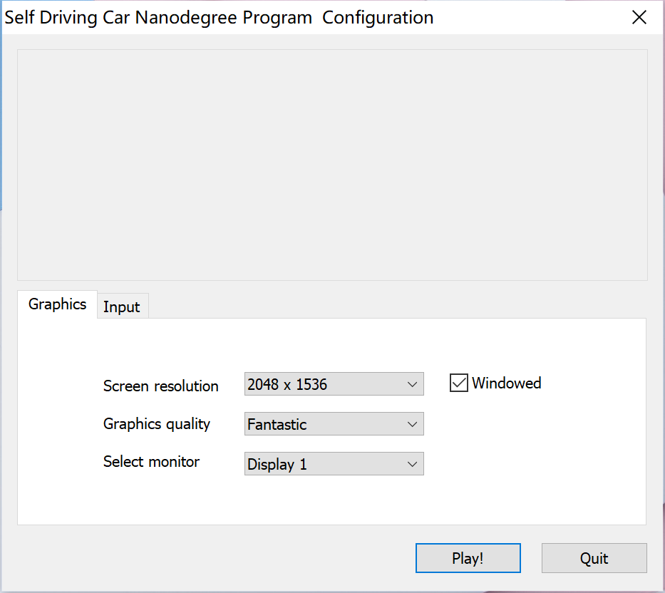
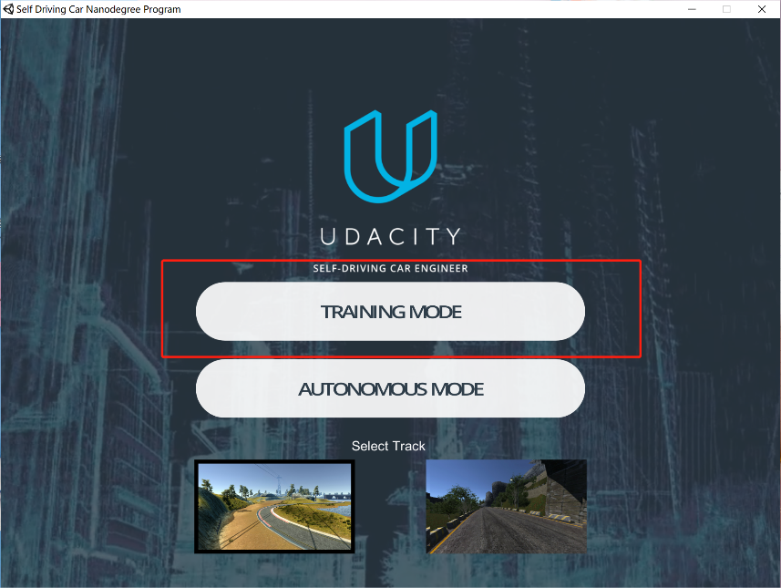
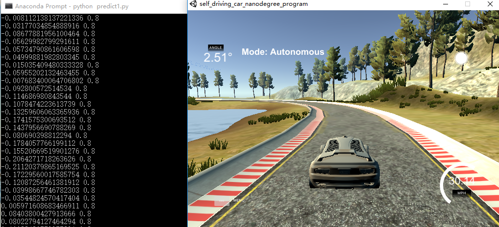
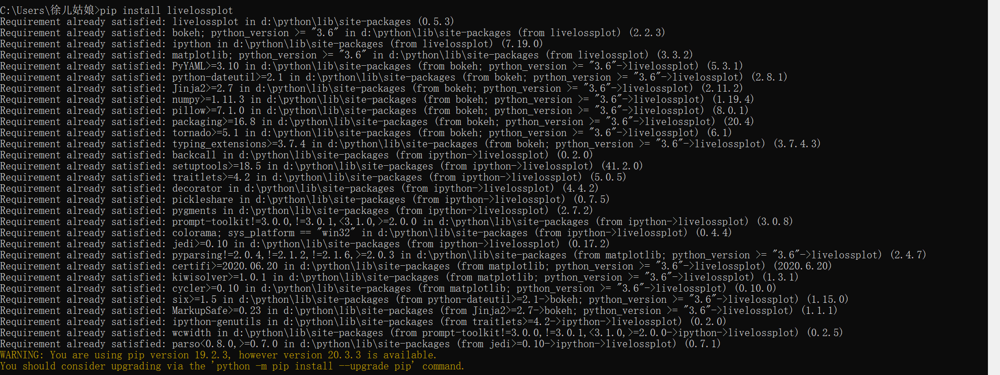
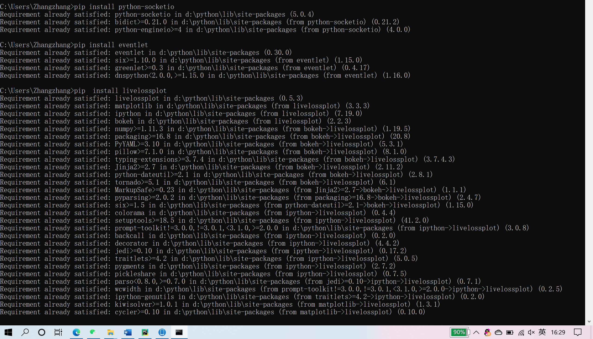

# Machine learning course assignments
1/8/2021
## Keras introduction
Keras is a Python deep learning framework that makes it easy to define and train almost any type of deep learning model. Keras was originally developed for researchers to experiment quickly

Keras has the following important features:
1. The same code can be seamlessly switched between CPU and GPU
2. User-friendly APIs that facilitate rapid development of prototypes of deep learning models
3. Built-in support for convolutional networks (for computer vision), circular networks (for sequence processing) and any combination of the two.
4. Support any network architecture: multi-input or multi-output model, layer sharing, model sharing, etc.

## Typical Keras workflow:
-  Define training data: input tensor and target tensor
-  Define a network composed of layers to map input to targets
-  Configuration learning process: selecting loss function, optimizer and indicators to be monitored
-  The FIT method of the model is called to iterate on the training data

## Install：
We  installed the installation package for this project：
-  Unity
-  Livelossplot
-  Socketio
-  eventlet

## Implementation steps:
1. Download the ZIP file provided by the teacher, extract and run the executable file
2. Unpack the downloaded Udacity Simulator package and click Run Beta_Simulator.exe. After running it, set the resolution and image quality first, starting with 640×480 and the Fastest, as shown below:
 
3. After setting, click Play to enter the simulator. After the simulator opens, click Training Mode, as shown below:
 

## Problems and solutions:
I found a mistake when downloading the installation package. After consulting Baidu, CSDN and my constant trial and error, I found the solution to the problem as the version problem, and finished the installation of the package after a series of trial and error, as shown below:  
 

## Summary:
This project is very interesting. We can learn the methods of code in the game. We constantly tried and made mistakes and felt the fun of writing code.
When installing the package, I came across a Socketio package and tried various methods, but still failed to install it. After consulting my fellow student, I downgraded it to 3.6 version using Python and upgraded PIP, and finally solved the problem. Running the code encountered a path problem, and after many attempts, it was finally solved.
In the process of this operation, I realized the importance of carefulness. At that time, because of the position of a symbol, I spent more than an hour in modifying the code, and finally found that the position was wrong. 
Thanks to professor and my seniors,with their help, I was able to finish the project well.  

--徐春燕  M105120308  

--张婉如  M105120306

